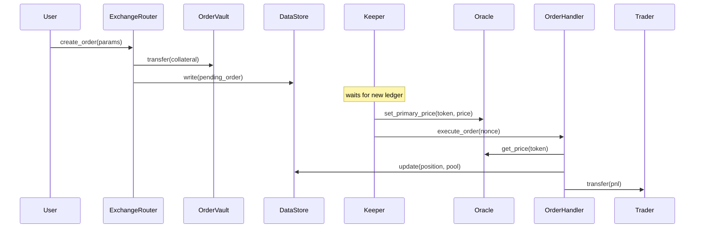

# Keeper Execution Flow

The protocol uses a **two-step execution model** to separate price commitment from order creation. This prevents frontrunning: the user's pending order is on-chain before any price is submitted, so no party can selectively fill orders only when prices are favourable.

## Why Two Steps?

| Single-step risk | Two-step fix |
|---|---|
| User submits order with price embedded → keeper can pick which orders to fill after seeing the price | User creates order first (no price) → keeper commits a price → keeper executes all eligible orders at that price |
| Order and price arrive in the same block → MEV extraction via tx ordering | Oracle price is recorded before execution; the keeper cannot cherry-pick |

## Sequence Diagram

## Success Path

1. **User → ExchangeRouter**: `create_order(params)` or `create_orders(requests)` (batch, max 5).
2. **ExchangeRouter → OrderVault**: transfers collateral from the user's wallet into the vault for increase/swap orders.
3. **ExchangeRouter → DataStore**: stores `OrderProps` (pending state) and records the key in the global and per-account order sets.
4. **Keeper**: detects the pending order event, fetches market prices from an external price source.
5. **Keeper → Oracle**: `set_primary_price(token, price)` — commits the price on-chain.
6. **Keeper → OrderHandler**: `execute_order(nonce)` — triggers dispatch.
7. **OrderHandler → Oracle**: reads the committed price.
8. **OrderHandler → DataStore**: updates position size, pool amounts, open interest, and funding trackers.
9. **OrderHandler → Trader**: transfers PnL (or refunded collateral for decrease orders) to `order.receiver`.
10. Order is removed from storage; keeper activity is recorded for heartbeat monitoring.

## Failure / Cancellation Path

- **Unsatisfied trigger**: for limit/stop orders, if the price condition is not met, `execute_order` reverts with `UnsatisfiedTrigger`. The order remains pending for the next execution attempt.
- **Frozen orders**: if execution fails repeatedly (e.g. oracle data unavailable), a keeper may call `freeze_order`. A frozen order cannot be executed until the owner calls `update_order`, which clears the frozen flag.
- **User cancellation**: the user (or any keeper) may call `cancel_order` at any time. For increase/swap orders the collateral is refunded from OrderVault back to the order's account.
- **Atomic batch**: `create_orders` is fully atomic — if any order in the batch panics, all orders in the batch are reverted (Soroban transaction atomicity).

## Roles Required

| Action | Required role |
|---|---|
| `set_primary_price` (Oracle) | `ORDER_KEEPER` |
| `execute_order` | `ORDER_KEEPER` |
| `freeze_order` | `ORDER_KEEPER` |
| `cancel_order` | account owner **or** `ORDER_KEEPER` |
| `liquidate_position` | `LIQUIDATION_KEEPER` |
| `execute_adl` | `ADL_KEEPER` |
| `create_order` / `create_orders` | any authenticated caller |

## Source References

- Exchange router entry point: [`contracts/exchange_router/src/lib.rs`](../contracts/exchange_router/src/lib.rs)
- Order lifecycle: [`contracts/order_handler/src/lib.rs`](../contracts/order_handler/src/lib.rs)
- Oracle price commitment: [`contracts/oracle/src/lib.rs`](../contracts/oracle/src/lib.rs)
- Vault custody: [`contracts/order_vault/src/lib.rs`](../contracts/order_vault/src/lib.rs)
- Role definitions: [`libs/keys/src/lib.rs`](../libs/keys/src/lib.rs)
